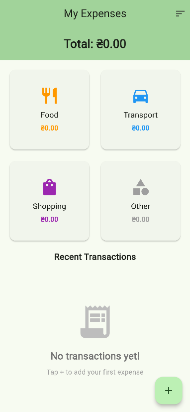
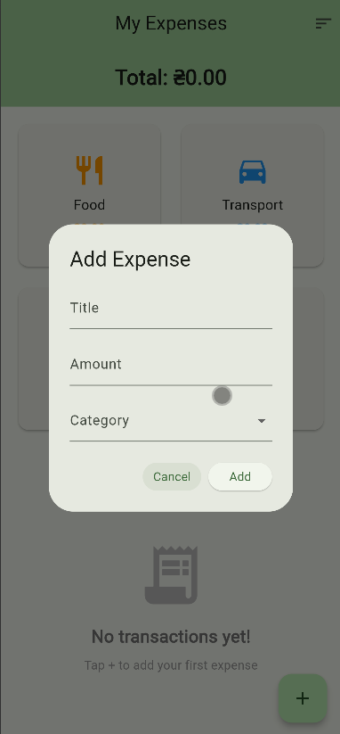
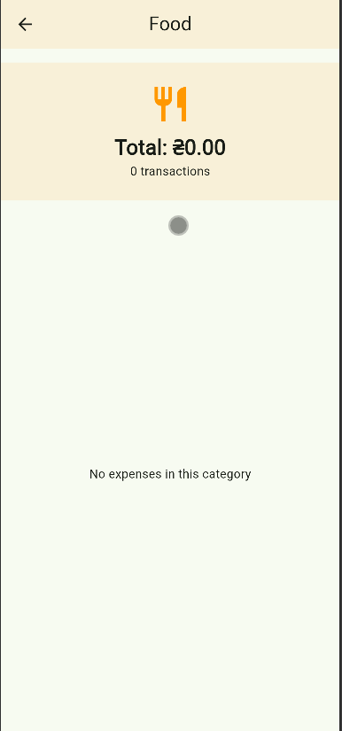

# Лабораторна робота №6: Комплексний проєкт (Блок 1) - Expense Tracker
**Виконав:** Маринич Данило

---

## 📱 Про проєкт
Цей застосунок є повноцінним трекером особистих витрат (Expense Tracker). Проєкт виступає підсумковою роботою Блоку 1 і об'єднує навички роботи з UI-версткою, керуванням станом (`StatefulWidget`), складними списками/сітками, навігацією та об'єктно-орієнтованим програмуванням у Dart.

### Виконані вимоги:
- ✅ Розроблено моделі даних `Expense` та `Category`. Використано `enum` з `extension` для мапінгу кольорів та іконок категорій.
- ✅ Реалізовано головний екран: містить сітку карток категорій (`GridView.builder`) та динамічний список останніх транзакцій (`ListView.builder`).
- ✅ Створено діалогове вікно (`AlertDialog`) для додавання нових витрат із повноцінною валідацією полів та випадаючим списком `DropdownButton`.
- ✅ Реалізовано розрахунок статистики: загальна сума всіх витрат та автоматичний підрахунок витрат по кожній окремій категорії.
- ✅ Додано навігацію (`Navigator.push`): при кліку на картку категорії відкривається новий екран з відфільтрованим списком витрат лише цієї категорії.
- ✅ Налаштовано видалення транзакцій через свайп з використанням віджета `Dismissible` та виводом `SnackBar`.
- ✅ 🌟 **Додаткове завдання (Варіант A):** Реалізовано динамічне сортування транзакцій (за датою та сумою) через виносний компонент `SortButton` в AppBar.
- ✅ 🌟 **Додаткове завдання (Варіант C):** Створено візуально приємний **Empty State** (екран порожнього списку), якщо транзакцій ще немає.

---

## 🏗 Архітектура проєкту
Щоб уникнути антипатерну *Massive Widget*, проєкт суворо дотримується принципу єдиної відповідальності (SRP). Логіку та UI розділено по папках:

- `lib/models/` — структури даних:
  - `expense.dart` — модель окремої транзакції з форматуванням дат.
  - `category.dart` — `enum` категорій та розширення для UI-мапінгу.
- `lib/screens/` — екрани застосунку:
  - `home_screen.dart` — головний контролер (зберігає стан `_expenses`).
  - `category_details_screen.dart` — екран статистики по конкретній категорії.
- `lib/widgets/` — декомпозиовані, незалежні UI-компоненти:
  - `add_expense_dialog.dart` — ізольована форма додавання витрати.
  - `category_card.dart` — картка категорії для `GridView`.
  - `transaction_list.dart` — віджет списку зі свайпом та Empty State.
  - `sort_button.dart` — кнопка-меню для зміни типу сортування.

---

## 🎓 Відповіді на питання

**1. Яка різниця між ListView та ListView.builder?** Звичайний `ListView` створює та рендерить абсолютно всі свої елементи одразу, що перевантажує пам'ять при великих списках. `ListView.builder` працює за принципом лінивого завантаження (lazy loading) — він рендерить лише ті картки, які знаходяться у видимій зоні екрана. При скролі старі картки видаляються з пам'яті, а нові створюються на льоту.

**2. Для чого потрібні extensions в Dart (на прикладі enum)?** За замовчуванням `enum` — це просто перелік констант (food, transport). `extension` дозволяє "розширити" цей перелік, додавши до нього геттери або методи. Завдяки цьому ми змогли інкапсулювати прив'язку кольорів (`Colors.orange`) та іконок (`Icons.restaurant`) безпосередньо в моделі, зберігаючи UI-код чистим.

**3. Як працює навігація між екранами у Flutter?** Flutter використовує стекову систему навігації. Метод `Navigator.push()` додає новий екран (наприклад, деталі категорії) поверх поточного в стек, і користувач бачить його. Метод `Navigator.pop()` (або кнопка "Назад" в AppBar) видаляє верхній екран зі стеку, повертаючи користувача на попередній.

**4. Навіщо потрібен key в Dismissible?** Властивість `key` необхідна фреймворку для однозначної ідентифікації віджета в `Widget Tree`. Коли ми видаляємо елемент зі списку свайпом, Flutter має точно знати, який саме віджет потрібно анімувати та прибрати. Використання унікального ключа (наприклад, `ValueKey(expense.id)`) гарантує, що Flutter не переплутає картки під час оновлення списку.

---

## 📸 Скріншоти

